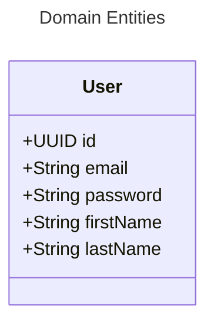

BACK-END ASSIGNMENT:

Create a database table for products with: title, price, description, and other info you see fit and populate it with data.

Display the products on homepage with an "Add to cart button" and a quantity input.

When adding to cart, the products in cat will be inserted in db, in a table designed by you.

After adding a product to cart, the user will be redirected to the cart page with a success or error message, there will be a table with the following columns:
- Current number (starting from 1)
- Name (name of the product)
- Quantity
- Price (depending on quantity)
- Remove product - after clicking this button, the product from that row will be removed from cart

There will be a button under the cart, which will take the user to the checkout page. Here will be an order form with the following fields: name, email, phone, address and optional notes.
You have to validate each field and show an error message if something is wrong, or a success message if everything is fine, insert data in a new db table called "orders" and clear the fields.

Implement a simple login form on a new page called Login.
The user should be in a db table and password should be encrypted.
After successful authentication, the user will be redirected to a page with a table containing all orders placed on the site.

TODO:
- servicos para
  - [ ] encriptar senha
  - [ ] gerar id de user
  - [ ] gerar id de cartItem
  - [ ] gerar id de order
- [ ] graphql para validar todas as regras de senha?
- [ ] regex para validar o email
- [ ] refatorar para usar objetos nos construtores
- [ ] uuid no user e no cartItem e order
- [ ] mapear id do cart item com id do product
- [ ] add dimensoes para os produtos
- [ ] separar user/authentication do ecommer em modoliths

---

